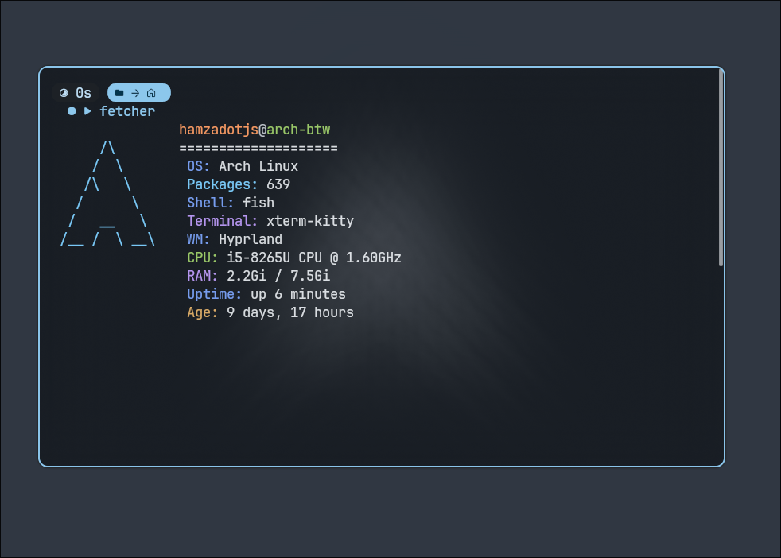
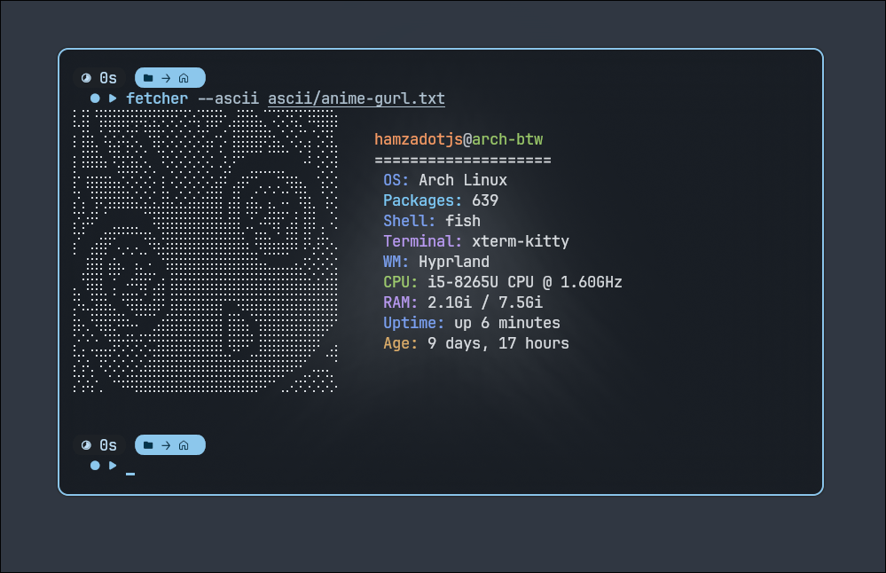

# Fetcher

A simple `neofetch` alternative, written in Python.

## Features

1. **Customizability:** Easily add or remove elements and recompile to your liking.
2. **Portability:** Lightweight and comes in at less than 20 Megabytes.
3. **Custom ASCII Art:** Full support for custom ASCII art layouts.



### With ASCII Art


---

## How to Use

### 1. Clone the repository & enter its directory
```bash
git clone [https://github.com/hamzadotjs/Fetcher.git](https://github.com/hamzadotjs/Fetcher.git)
cd ~/Fetcher

```

### 2. Install Python and pipx

For example, on **Arch Linux**:

```bash
sudo pacman -S python pipx

```

### 3. Install PyInstaller

PyInstaller is used to compile the Python script into a standalone executable:

```bash
pipx install pyinstaller

```

### 4. Build Fetcher

```bash
pyinstaller --onefile main.py

```

### 5. Add it to your PATH

First, ensure your `~/.local/bin` is included in your system's PATH:

```bash
echo 'export PATH="$HOME/.local/bin:$PATH"' >> ~/.bashrc # or ~/.zshrc if you use Zsh

```

### 6. Symlink Fetcher to your bin directory

```bash
ln -sf ~/Fetcher/dist/main ~/.local/bin/fetcher

```

### 7. Enjoy!

Simply run `fetcher` in your terminal.

