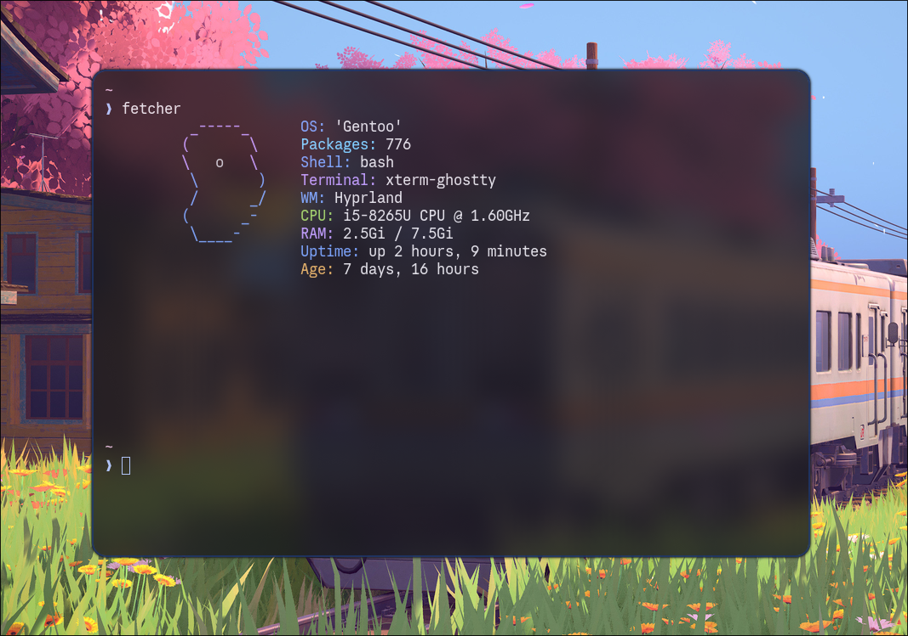
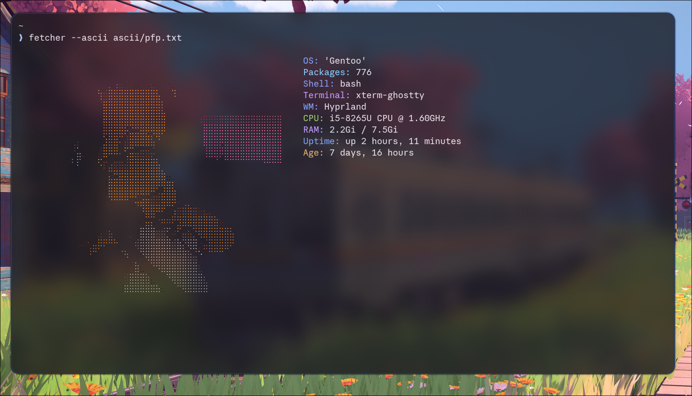

#+title: Fetcher

* A simple neofetch alternative, written in python

* Features
1. Customizability: you can add or remove whatever you want and recompile.
2. Portability: Its less that 20 MegaBytes.
3. Custom ascii art support.

* With ascii:

** How to use

*simple*
*** 1. Clone the repository & Enter it's directory
        #+BEGIN_SRC bash
        git clone https://github.com/hamzadotjs/Fetcher.git
        cd ~/Fetcher
        #+END_SRC
*** 2. Install python and pipx
**** for exmaple, On Arch Linux
#+BEGIN_SRC bash
sudo pacman -S python pipx
 #+end_SRC
*** 3. Install Pyinstaller (What we use to compile the python file to an executable)

#+BEGIN_SRC bash
pipx install pyinstaller
#+end_SRC
*** 4. Build fetcher!

#+BEGIN_SRC bash
pyinstaller --onefile main.py
#+end_SRC
*** 6. add it to PATH:
**** 6.1. Add .local/bin to PATH

#+BEGIN_SRC bash
echo export PATH="$HOME/.config/emacs/bin:$HOME/.local/bin:$PATH" | tee .bashrc # or zshrc if you use zsh
#+end_SRC
**** 6.2 Symlink fetcher to .local/bin

#+BEGIN_SRC bash
ln -sf ~/Fetcher/dist/main ~/.local/bin/fetcher
#+end_SRC

*** 7. Enjoy!
